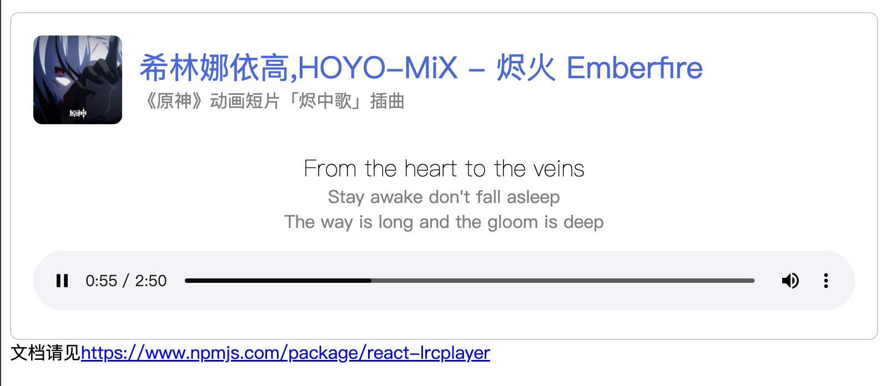

## 带LRC歌词的简易播放器

### 功能

*   标题副标题显示
*   封面展示
*   歌词动画
*   定义歌词行数
*   原生audio播放器
*   lrc歌词同步显示（需提前转换为json）

本项目基于React开发，仅在React Vite环境测试通过。

体验：[https://os.arsrna.cn/demo/nodejs/lrcplayer](https://os.arsrna.cn/demo/nodejs/lrcplayer)

## DEMO

克隆本项目，并执行

```plaintext
npm i
npm start
```

打开localhost:5173即可测试demo


## 用法

## 安装

```shell
npm i react-lrcplayer
```

## 引入

```typescript
import { LRCPlayer,createLrcObj } from 'react-lrcplayer';
// 全局引用样式
import 'react-lrcplayer/index.css';
```

## 示例

在页面中（以example/App.tsx的vite环境为例）：

```tsx
 <LRCPlayer
        src={src}
        cover={cover}
        title="希林娜依高,HOYO-MiX - 烬火 Emberfire"
        subTitle="《原神》动画短片「烬中歌」插曲"
        lrc={lrc}
        placeholder="无歌词"
        offset="-0.3"
        animate={{
          type: "slide",
          duration: 8,
        }}
        nextLrc={{
          display: true,
          number: 2
        }}
    />
```

## API

| 参数     | 类型               | 内容                           | 默认值                          | 必填 |
| -------- | ------------------ | ------------------------------ | ------------------------------- | ---- |
| src      | file / string      | 音频文件URL地址                | undefined                       | 是   |
| cover    | file / string      | 封面图片文件URL                | undefined                       | 是   |
| title    | string / React DOM | 播放器标题                     | ""                              | 否   |
| subTitle | string / React DOM | 副标题                         | ""                              | 否   |
| lrc      | object             | lrc对象，内容见下文            | undefined                       | 是   |
| offset   | number             | 偏移量，正数为延后，负数为提前 | 0                               | 否   |
| animate  | object             | 动画设置，内容见下文           | { type: "fade", duration: 0.5 } | 否   |
| nextLrc  | object             | 下句歌词显示设置，内容见下文   | { display:false, number:5 }     | 否   |

## lrc

此参数表示歌词对象，本框架已内置lrc转为对象的功能，如下LRC：

可以直接调用 `createLrcObj(lrc歌词原内容)`来实现转换

```plaintext
[00:26.446]天气晴 风平浪静 沙滩上混乱的脚印
[00:32.499]钓鱼竿 两份孤单 会飞的落汤鸡
[00:37.725]是故事的开局
```

转换为对象即为

```json
[{
    "t": 26.446,
    "c": "天气晴 风平浪静 沙滩上混乱的脚印"
  },{
    "t": 32.499,
    "c": "钓鱼竿 两份孤单 会飞的落汤鸡"
  },{
    "t": 37.725,
    "c": "是故事的开局"
}]
```

| 参数 | 类型   | 内容         |
| ---- | ------ | ------------ |
| t    | number | 进入时间点   |
| c    | string | 对应歌词内容 |

## animate

| 参数     | 类型   | 内容                                          | 默认值 | 必填 |
| -------- | ------ | --------------------------------------------- | ------ | ---- |
| type     | string | 动画类型（划入: slide，淡入: fade，无: none） | fade   | 否   |
| duration | number | 动画持续时间，单位秒                          | 0.5    | 否   |

## nextLrc

| 参数    | 类型    | 内容     | 默认值 | 必填 |
| ------- | ------- | -------- | ------ | ---- |
| display | boolean | 是否显示 | true   | 否   |
| number  | number  | 显示句数 | 2      | 否   |