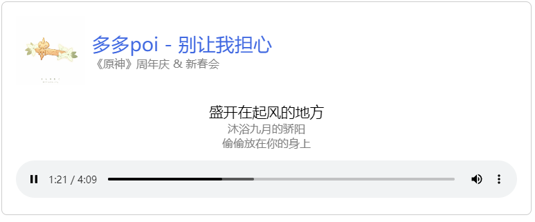

# 带LRC歌词的简易播放器



## 功能

- 标题副标题显示
- 封面展示
- 歌词动画（下版本）
- 定义歌词行数（下版本）
- 原生audio播放器
- lrc歌词同步显示（需提前转换为json）

本项目基于React开发，仅在React测试通过。

体验：[https://os.arsrna.cn/demo/nodejs/react-lrcplayer](https://os.arsrna.cn/demo/nodejs/react-lrcplayer)

# 用法

## 安装

```
npm i react-lrcplayer
```

## 引入

````jsx
import { LRCPlayer,createLrcObj } from 'react-lrcplayer';
````

## 示例

在页面中：

````jsx
<LRCPlayer
      src={require("./1_多多poi - 别让我担心_(Instrumental).mp3")}
      cover={require("./cover.jpg")}
      title="多多poi - 别让我担心"
      subTitle="《原神》周年庆 & 新春会"
      lrc={require("./lrc.json")}
      offset={-0.3}
    />
````

# API

| 参数     | 类型               | 内容                                                 | 默认值    | 必填 |
| -------- | ------------------ | ---------------------------------------------------- | --------- | ---- |
| src      | file / string      | 音频文件，可以使用 `require/import`引入或音频URL     | undefined | 是   |
| cover    | file / string      | 封面图片文件，可以使用 `require/import`引入或音频URL | undefined | 是   |
| title    | string / React DOM | 播放器标题                                           | undefined | 是   |
| subTitle | string / React DOM | 副标题                                               | undefined | 是   |
| lrc      | object             | lrc对象，内容见下文                                  | undefined | 是   |
| offset   | number             | 偏移量，正数为延后，负数为提前                       | 0         | 否   |

## lrc

此参数表示歌词对象，本框架已内置lrc转为对象的功能，如下LRC：

```text
[00:26.446]天气晴 风平浪静 沙滩上混乱的脚印
[00:32.499]钓鱼竿 两份孤单 会飞的落汤鸡
[00:37.725]是故事的开局
```

转换为对象即为

```json
[{
    "t": 26.446,
    "c": "天气晴 风平浪静 沙滩上混乱的脚印"
  },{
    "t": 32.499,
    "c": "钓鱼竿 两份孤单 会飞的落汤鸡"
  },{
    "t": 37.725,
    "c": "是故事的开局"
}]
```

其中，`t`为进入时间点，`c`为对应歌词内容；
可以直接调用 `createLrcObj(lrc歌词原内容)`来实现转换

# 常见问题

## React is not defined

dependency 默认会安装React，如果没有安装，请手动 `npm i react`，并 `import React from 'react';`
